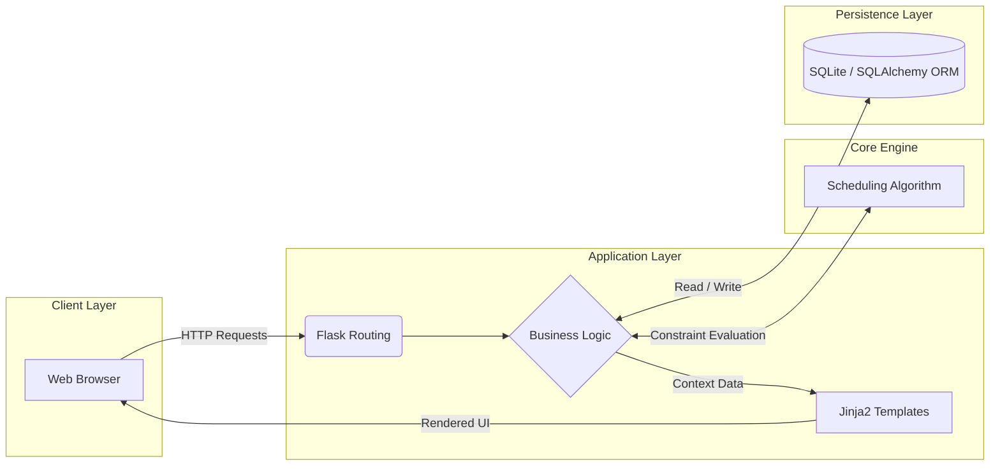

<h1 align="center">University Examination Scheduling System</h1>

</p>
  <i>An automated, high-performance Flask application engineered to optimize examination schedules, mitigate resource conflicts, and maximize classroom utilization through algorithmic constraint satisfaction.</i>
</p>

<p align="center">
  <a href="https://www.python.org/"></a>
  <a href="https://flask.palletsprojects.com/"></a>
  <a href="https://www.sqlite.org/"></a>
  <a href="https://opensource.org/licenses/MIT"></a>
</p>

---
## Screenshots

<details>
<summary>View Screenshots</summary>

<br>

<p align="center">
  
  <br>
  <strong>User Login Screen</strong>
</p>

<p align="center">
  
  <br>
  <strong>Admin Dashboard Home</strong>
</p>

<p align="center">
  
  <br>
  <strong>Course Management Screen</strong>
</p>

<p align="center">
  
  <br>
  <strong>Classroom Management Screen</strong>
</p>

<p align="center">
  
  <br>
  <strong>Exam Scheduling Screen</strong>
</p>

<p align="center">
  
  <br>
  <strong>Student Management Screen</strong>
</p>

<p align="center">
  
  <br>
  <strong>Instructor Management Screen</strong>
</p>

<p align="center">
  
  <br>
  <strong>Special Case Management Screen</strong>
</p>

<p align="center">
  
  <br>
  <strong>Management Panel</strong>
</p>

<p align="center">
  
  <br>
  <strong>Reporting Screen</strong>
</p>

<p align="center">
  
  <br>
  <strong>Exam Timetable Panel</strong>
</p>

<p align="center">
  
  <br>
  <strong>My Exams Panel</strong>
</p>

<p align="center">
  
  <br>
  <strong>Database Viewer Screen</strong>
</p>

</details>


## Quick Access

| Section | Description |
| :--- | :--- |
| **[Purpose & Scope](#purpose--scope)** | System objectives and core deliverables |
| **[System Architecture](#system-architecture)** | Multi-tier application layers and data flow |
| **[Installation](#prerequisites--installation)** | Environment setup and initialization procedures |
| **[Configuration](#environment-variables)** | Operational parameters and database connectivity |
| **[Execution](#execution)** | Startup commands and deployment |

---

## Purpose & Scope

| Objective | Detailed Description |
| :--- | :--- |
| **Automation** | Eliminates manual intervention and dependencies in the exam scheduling lifecycle. |
| **Conflict Resolution** | Mitigates scheduling overlaps for both students and academic personnel. |
| **Resource Optimization** | Maximizes the efficiency of spatial allocations based on strictly enforced classroom capacities. |
| **Administrative Efficiency** | Streamlines operational tracking and generates comprehensive analytical reports. |

---

## System Architecture

The application is structured around a multi-tier architectural pattern, ensuring strict decoupling between the client interface, business logic, algorithmic processing, and data persistence.


## Explore Directory Structure

```text
project-root/
├── app.py                     # Application entry point
├── config.py                  # Environment configurations
├── requirements.txt           # Dependency declarations
├── models/                    # Data Access Layer (SQLAlchemy ORM)
├── routes/                    # Business Logic Layer (Flask Blueprints)
├── templates/                 # Presentation Layer (Jinja2 Templates)
├── static/                    # Static Assets (CSS, JavaScript)
└── algorithms/
    └── planlama_algoritmasi.py # Core Scheduling Algorithm
```
</details>

---

## Core Scheduling Engine

The algorithmic logic, centralized within `algorithms/planlama_algoritmasi.py`, acts as the computational brain of the system. It evaluates matrices based on three absolute constraints:

1. **Student Isolation:** Guarantees zero concurrent exam assignments for any individual student record.
2. **Spatial Boundaries:** Enforces rigid allocation limits, ensuring assigned seats never exceed physical classroom capacities.
3. **Temporal Density:** Compresses the scheduling matrix to maximize the utilization of available academic time slots.

---

## Prerequisites & Installation

### System Requirements

| Component | Minimum Specification |
| :--- | :---: |
| **Interpreter** | `Python 3.8+` |
| **Package Manager** | `pip` |

### Environment Setup

1. **Initialize an isolated virtual environment:**
   ```bash
   python -m venv venv
   
```

2. **Activate the environment:**
   * **Linux/macOS:** `source venv/bin/activate`
   * **Windows (PowerShell):** `.\venv\Scripts\Activate.ps1`
   * **Windows (CMD):** `.\venv\Scripts\activate.bat`

3. **Install exact dependencies:**
   ```bash
   python -m pip install --upgrade pip
   pip install -r requirements.txt
   
```

---

## Environment Variables

For both local development and production deployments, the system behavior is dictated by a `.env` configuration file located at the repository root.

```env
# Application runtime mode (development/production)
FLASK_ENV=development

# Cryptographic salt for secure session management
SECRET_KEY=your_secure_cryptographic_key

# Database target connection string
DATABASE_URL=sqlite:///data.db
```

> [!IMPORTANT]
> To maintain security protocols, never commit your `.env` file to version control. Utilize a `.env.example` template for repository tracking.

---

## Database Management

| Specification | Implementation Detail |
| :--- | :--- |
| **ORM Framework** | SQLAlchemy |
| **Default Engine** | SQLite (Production ready for PostgreSQL/MySQL via URI switch) |
| **Schema Target** | `sqlite:///data.db` |

> [!TIP]
> A dedicated CLI utility is provided to inspect the current state of the database schema without requiring external GUI tools.
> ```bash
> python veritabani_goruntule.py
> 


## Execution

Initialize the application server utilizing the appropriate command for your host operating system.

| Host OS | Execution Command |
| :--- | :--- |
| **Platform Agnostic** | `python app.py` |
| **Linux / macOS** | `./run.sh` |
| **Windows** | `.\run.bat` |

> [!NOTE]
> Upon successful initialization, the application binds to the local interface and will be accessible at `http://127.0.0.1:5000`.

---

<div align="center">
  <br>
  Distributed under the <strong>MIT License</strong>.
</div>

